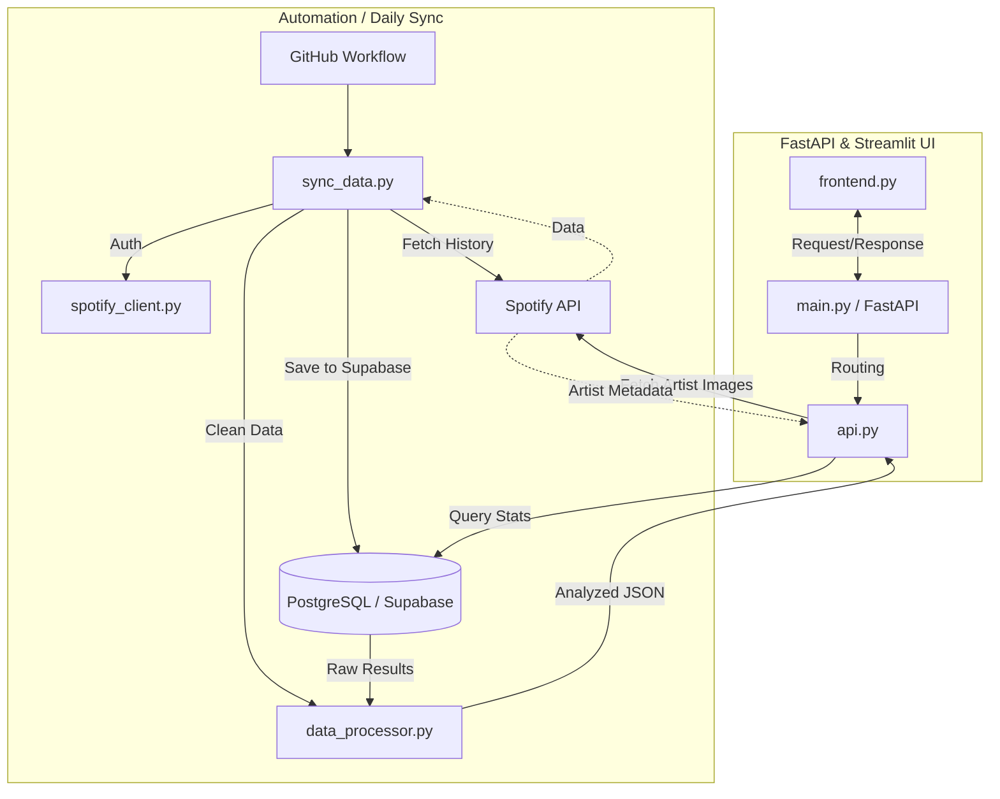

# Monthly wrapped (under construction)
Personal data engineering project that uses spotifys APIs to analyse listening stream. 
The application works in a following way:

The app fetches 50 recently played tracks every night from spotify API by using automated github workflow and puts them to database. The database is hosted by Superbase and has two tables: tracks and streams. Tracks hold information about every unique song played while streams records every track and the time the track was played. 
App contains minimum frontend, done with streamlit library. In the frontend it is possible to select different month or all time for analysis. Upon request the frontend shows the monthly analysis. For the analysis, the backend fetches selected months streams and analyses the data. 

#### User can:
* See top 10 songs of the month and how many times they were played
* Top 10 artists of the month and how many songs were played
* Time of the day when user listens most
* Minutes spent listening
* Total number of artists played that month
* Total number of songs played that month

## Architecture:

  
### Table structures

Track table:
|  track_id  |  artist_id  | song_name | artist_name | image | duration_ms |
| ---------- | ----------- | --------- | ----------- | ----- | ----------- |
| text (pk) | text    |  text    | text    | text    | int    |

Streams table:
|  id  |  track_id  | played_at | 
| ---- | ---------- | --------- | 
| int (pk) | text    |  timestamp    | 

### Technologies:
* Automation: Github workflow
* Backend: poetry (dependency managament), python, psycopg2 (postgreSQL)
* Frontend: streamlit
* DB: Superbase
* API: spotify web api

## Limitations:
* spotify seems only to add the song to recently played tracks after the user has played the song and moved on to the next song. This means that if the user doesn't move to the next song and keeps replaying one song without it ever ending (e.g skipping to the start of the song before the song ends) the spotify API only adds it once. The replays are only added if user moves onto the next song and goes back to the previous song.
* The spotify API only has 50 recently played songs. If user plays more than 50 songs before the github workflow is run, those songs will not be recorded. Currently, the github workflow fetches songs from the API once a day in the evening.

## To run project (make sure you have poetry):
install dependencies: 
`poetry install `

run project: `poetry run poe dev`, this command runs frontend and backend. If you prefer to run frontend and backend separately:
`uvicorn main:app --reload` and `poetry run streamlit run frontend.py`

